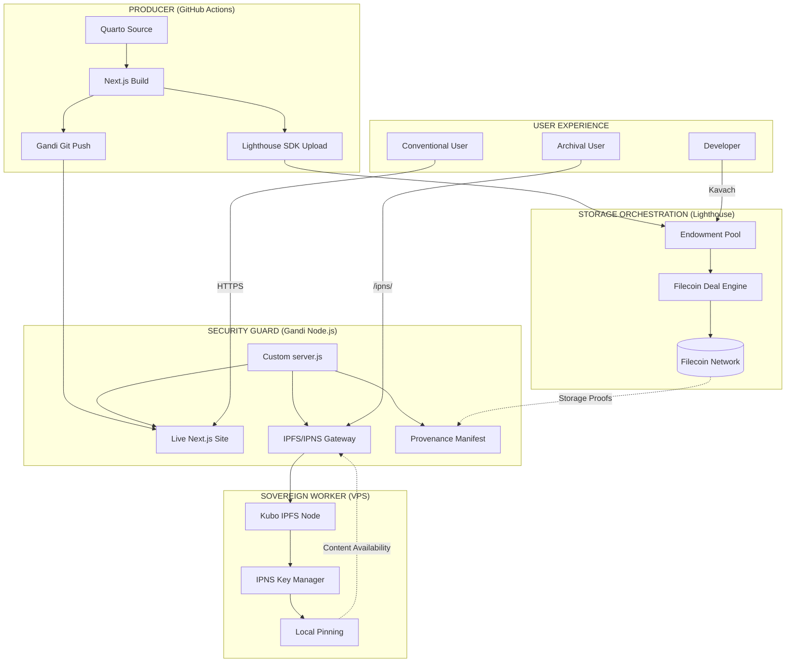

# Real-Currents Sovereign Storage Stack

Unified technical blueprint integrating Quarto/Next.js frontend, Gandi/Worker gateway, and Lighthouse/Filecoin orchestration.

## Architecture

## Capabilities

| Access | URL | Use Case |
|--------|-----|----------|
| **Live Site** | `real-currents.com/xr/baseline-0` | Fast, SEO-optimized |
| **Stable Archive** | `real-currents.com/ipns/xr-baseline-0` | Verifiable, sovereign |
| **Perpetual Backup** | Lighthouse/Filecoin | Endowment-funded, decades-long |
| **Sensitive Data** | Kavach Encryption | Threshold-protected PII/Drafts |

## Required Secrets

- `LIGHTHOUSE_API_KEY` – From [Lighthouse dapp](https://files.lighthouse.storage)
- `DEPLOY_SECRET` – Shared secret for IPNS publish API (set on Gandi server too)

## Gateway Deployment

1. Deploy `gateway/` to Gandi VPS
2. Set `DEPLOY_SECRET` environment variable
3. (Optional) Configure Kubo IPFS for IPNS publishing
